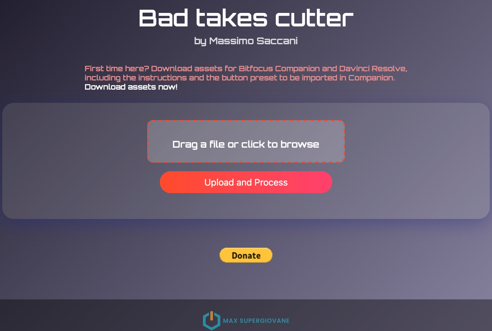
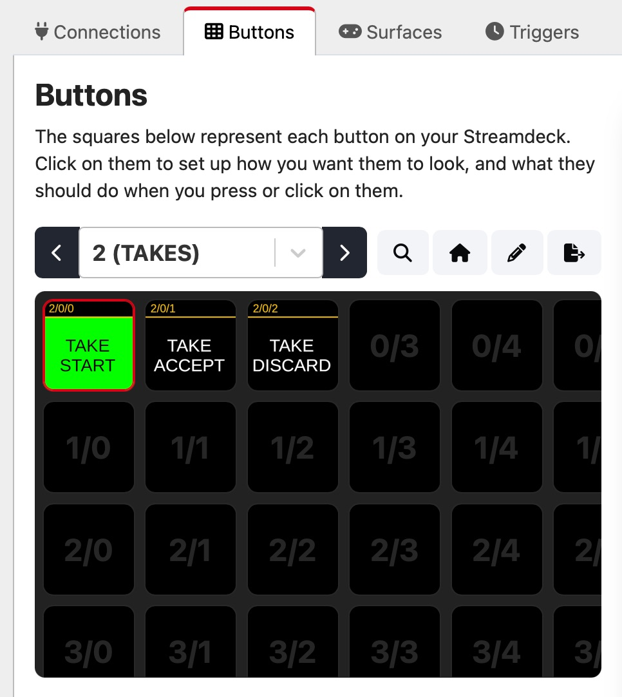

# Bad takes cutter
Bad takes cutter for Blackmagic Davinci Resolve and Bitfocus Companion.  
The Atem Mini Extreme ISO creates a project file compatible with Davinci Resolve, together with all video and audio files. This file contains all the takes you record whenever you press RECORD on the Atem.  
This tool has been confirmed working with the Atem Mini Extreme ISO (not tested with other Atems) and it's aimed to speed up youtubers and content creators workflow, by automatically delete the bad takes from such file.  

## Workflow

You record your takes (bad and good ones) **->>** END **->>** You upload the project file created by your Atem into the Bad takes cutter's web page **->>** You download the purged project file to be directly imported into Davinci Resolve.

## Web site: http://casacorte.ddns.net:3000

**ASSETS DOWNLOAD**

- <a id="raw-url" href="https://github.com/Supergiovane/davinci-resolve-bad-takes-cutter/releases/download/1.0.0/BAD-TAKE.png">BAD-TAKE image</a>
- <a id="raw-url" href="https://github.com/Supergiovane/davinci-resolve-bad-takes-cutter/releases/download/1.0.0/buttons.companionconfig">Companion Buttons</a>

Load the BAD-TAKE.jpg in the Atem's media pool, in the position #5, using the Atem Control Software. Then, import the Companion Button file into Bitfocus Companion, using the "Import configuration file" button, located in the import/export TAB. You're done.  
[View this youtube VIDEO](https://youtu.be/9UiCROFJnt0), to take a look of the entire process.

## **How it works**:  

Start a take by pressing **TAKE START**. The Atem will start recording.

- If the take is good, press **TAKE ACCEPT**. The Atem will stop recording and accept the take.
- If the take is bad, press **TAKE DISCARD**. The Atem will stop recording and mark the take as rejected.

Once done with your recordings, [GO HERE](http://casacorte.ddns.net:3000) and:

- Upload your .drp project file, taken from the Atem and press "Upload and Process".
- Put the downloaded clean project file into the same folder as the original .drp project file, then double click it. The clean project file contains good takes and gaps where it was bad takes.
- To delete timeline gaps in DaVinci Resolve, Select **all clips (Cmd+A or ctrl+A) in the timeline's Edit page**, then go to the **Edit** menu and click **Delete Gaps**.  
  
You can either use the online service provided by the developer (myself), or download this repository and set up the service on your own. Alternatively, if you're familiar with JavaScript, you can modify the <code>cleanBadTakes.js</code> file and create your own script to run within DaVinci Resolve.  
If you use the online service provided by the developer, please consider a little donation to support the development. 

    

