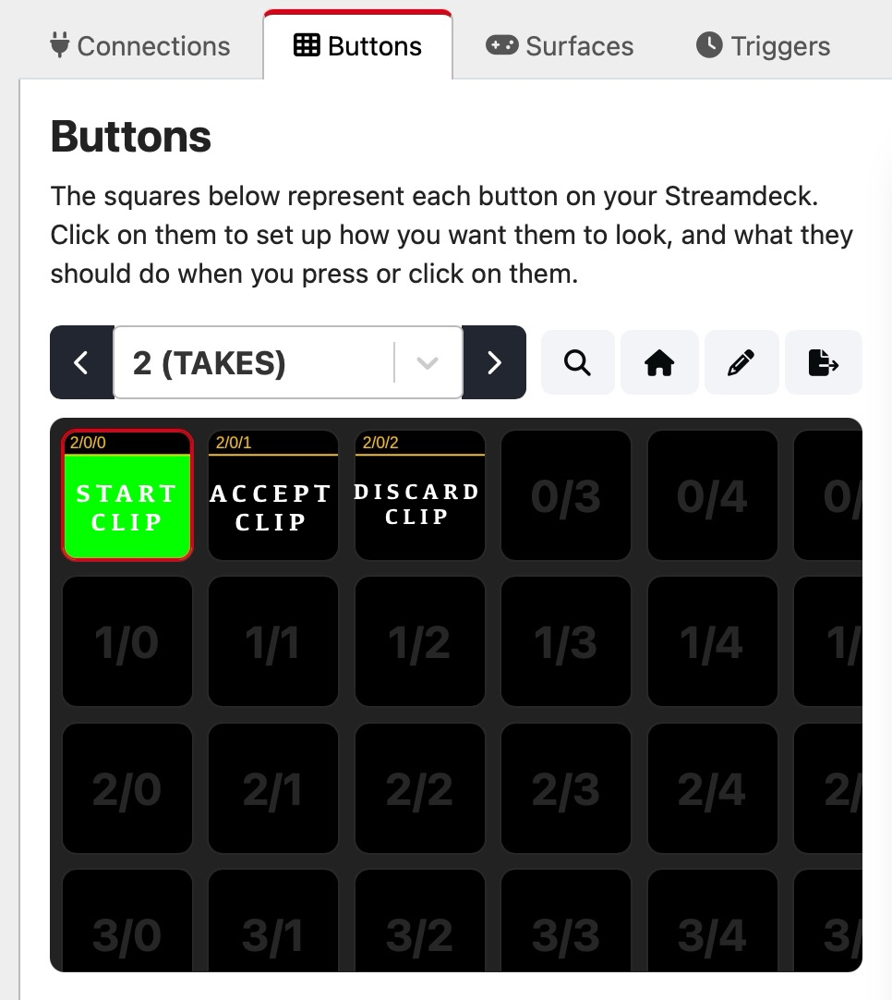

# Bad takes cutter for Blackmagic Davinci Resolve and Bitfocus Companion.

First time here? 
[View the youtube video](https://pages.github.com/) 

Load the BAD-TAKE.jpg in the Atem Control Software and Import the Companion Button: 

- [BAD-TAKE image](./public/BAD-TAKE.png "download")
- <a id="raw-url" href="https://raw.githubusercontent.com/Supergiovane/davinci-resolve-bad-takes-cutter/master/public/BAD-TAKE.png">Download FILE</a>
- [Companion Buttons](./public/buttons.companionconfig)

 

## **How it works**:  

Start a take by pressing **TAKE START**.

- If the take is good, press **TAKE ACCEPT**.
- If the take is bad, press **TAKE DISCARD**.

Once finished, [GO HERE](https://pages.github.com:3000/) and:

- Upload your .drp project file, taken from the Atem and press "Upload and Process".
- Put the downloaded clean project file into the same folder as the original .drp project file, then double click it. The clean project file contains good takes and gaps where it was bad takes.
- To delete timeline gaps in DaVinci Resolve, Select **all clips (Cmd+A) in the timeline's Edit page**, then go to the **Edit** menu and click **Delete Gaps**. 

